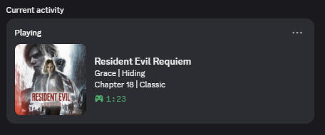
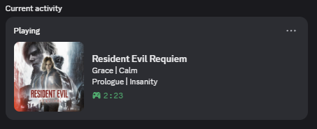
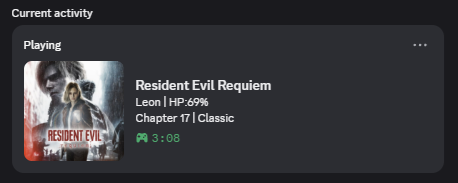

# Discord Rich Presence for Resident Evil: Requiem

A simple REFramework mod that shows what you're doing in Resident Evil: Requiem (RE9) on your Discord profile!

  
  
  

## What it shows
- **Game Info:** Current Chapter and Difficulty
- **Who you're playing as:** Leon or Grace
- **Leon's Stats:** HP
- **Grace's State:** Her mental state (Calm, Vigilance, Agony, etc.)

Everything is fully customizable through `config.ini`, and you can translate text using `Discord_Presence_RE9_Translation.ini`.

## How to install
1. Make sure you have **REFramework** installed ([Nexus](https://www.nexusmods.com/residentevilrequiem/mods/13) or [Github](https://github.com/praydog/REFramework-nightly/releases)).
2. Download the mod.
3. Drop `DiscordPresenceRE9.dll` right into your `reframework/plugins/` folder.

## Building from source
If you want to compile the mod yourself, just use the `build.bat` script or use `CMakeLists.txt` for your favorite IDE.

## For Developers
File `reframework/autorun/discord_scout.lua` is included just to help find game values and testing things out. You don't need it for normal use.

## Credits
Inspiration: [Discord Rich Presence (RE4 Remake)](https://www.nexusmods.com/residentevil42023/mods/1449) by TommInfinite

## License
Check the [LICENSE](LICENSE) file.
